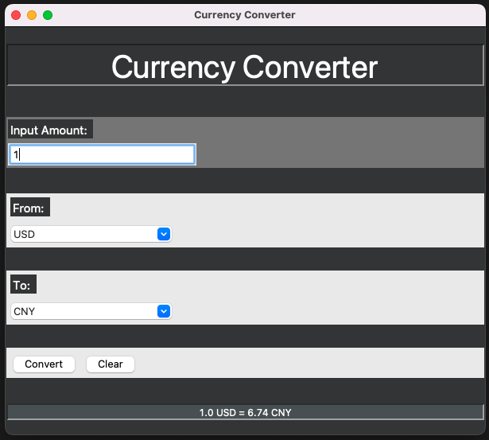

# Currency-Converter

## Instruction:

This is a responsive currency converter GUI built by Python and Tkinter.

The converter is based on ERU.

The application is distributed by PyInstaller.

## How to run:

have python3 (requests, tkinter) installed

```Shell
python3 Currency_Converter.py
```

## Screen Shot:



## References

[latest exchange rate](https://api.exchangerate.host/latest)

[Tkinter Tutorials](https://realpython.com/python-gui-tkinter/#conclusion)

[Using PyInstaller to Easily Distribute Python Applications](https://realpython.com/pyinstaller-python/)
