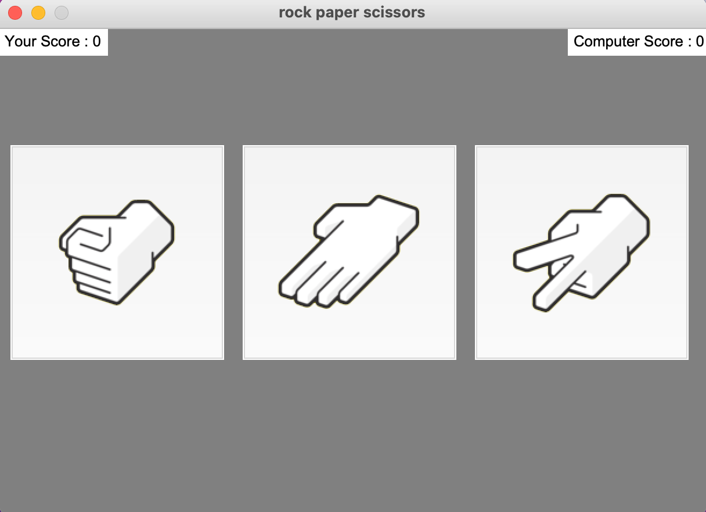
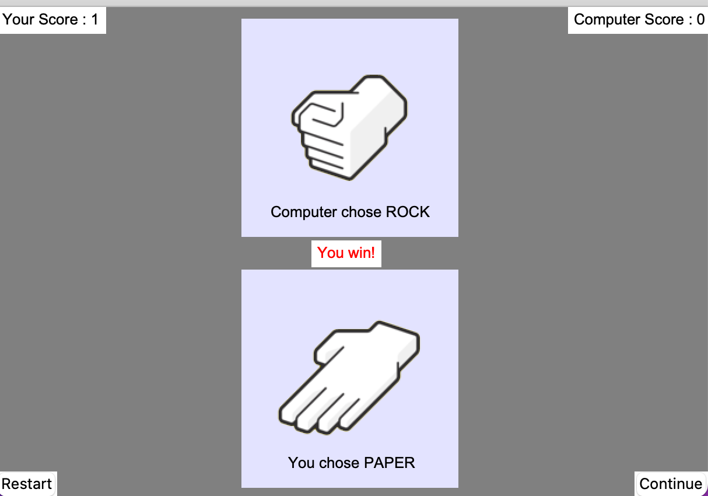

# Rock-Paper-Scissors Game

## Instruction:

This is a simple Rock-Paper-Scissors Game game GUI built by Python and Tkinter.

The application is distributed by PyInstaller.

## How to run:

have python3 (tkinter) installed

```Shell
python3 game.py
```

## Screen Shot:





## References

[Rock-Paper-Scissors Icon](https://github.com/forooghl/rock_paper_scissors_GUI/tree/master/Icon)

[Tkinter Tutorials](https://realpython.com/python-gui-tkinter/#conclusion)

[Using PyInstaller to Easily Distribute Python Applications](https://realpython.com/pyinstaller-python/)