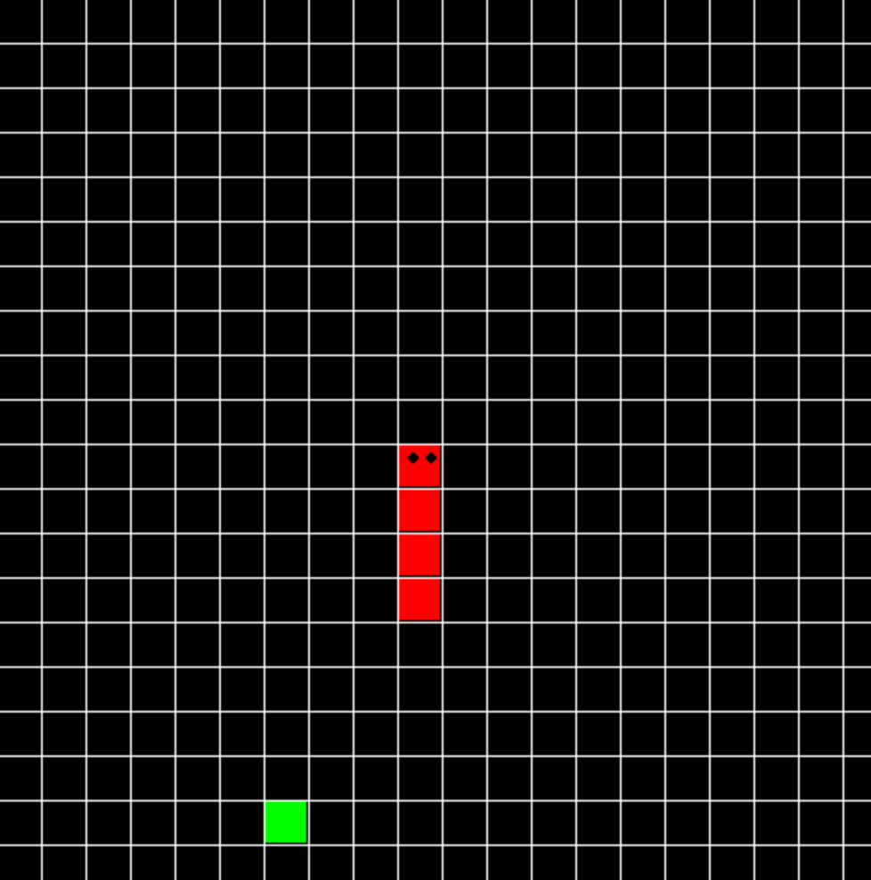

# Snake Game

## Instruction:

This is a classical Snake game built by Pygame and Tkinter.

The application(version 1) is distributed by PyInstaller.

Version 1: can reach the boundary (traverse to the other side)
Version 2: can not reach the boundary

## How to run:

have python3 (pygame tkinter) installed

```Shell
python3 snake_1.py/snake_2.py
```

## Screen Shot:




## References

[Pygame Tutorials](https://realpython.com/pygame-a-primer/#note-on-sources)

[Using PyInstaller to Easily Distribute Python Applications](https://realpython.com/pyinstaller-python/)